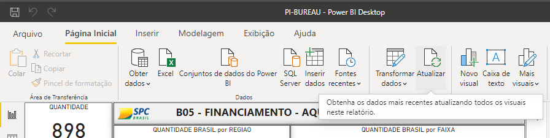

#### :books: This is a study project in colab with SPC Brasil, all data used are fake but are in sight with the data they possess.
#### :running: The goal is to develop a business oriented product that can be of value to the company based on the data.
# So what is our product?
#### :pushpin: A dashboard that delivers a holistic vision of the vehicle financing scenario in order to provide market intel to vehicle dealers and possibly fabricators.
ps: it sounds cooler than we thought it would. 🤭
#### :mag_right: take a hint:

### :camera: <a href="SCREENSHOTS.md"> Click here to see all the screenshots

## :electric_plug: Requirements:
- Microsoft Power BI >= 2.82
- Python >= 3.8.2
- Pandas >= 1.0.5
- matplotlib >= 3.2.1

Note: To visualize our sample you will only need to have Microsoft Power BI. :blush:

## About the solution

#### 📤 It emulates a backend processment of the data found in the SPC's database with Python. Then, delivers it to the frontend, witch is represented by the power BI solution.

#### 💻 The frontend is ready to be used for the data sample we recieved, simply open PI-BUREAL.pbix and enjoy. 

#### We implemented the possibility to update the data entry. (See the Getting Started section to know how it works)

## Getting Started

### Frontend

No steps required, except opening the .pbix file.

### Backend

##### :warning: This is only necessary if you want to updade the data been shown.

#### Updating data entry
  
- Run setup.py
- Select the respective files
- Click on the button "Processar"
- Click on the button "Sair" to close the window

- Open PI-BUREAL.pbix
- On the home tab, click on update (if asked, click yes to enable scripts on powerBI)

## Team (5) Bureal-SqPy 
[*Charles Ramos (PO)*](https://github.com/charles-ramos)      
[*João Pedro Santos (MASTER)*](https://github.com/QuodJP)      
[*Beatriz Coutinho*](https://github.com/bibiacoutinho)      
[*Felipe Costa*](https://github.com/fcostafelipe)      
[*Daniel Oliveira*](https://github.com/danielsantosoliveira)                                                                           
[*João Victor Gallina*](https://github.com/JVMedeiros)                                                                                 
[*Marcelo Uchôas*](https://github.com/marcelouchoas)
